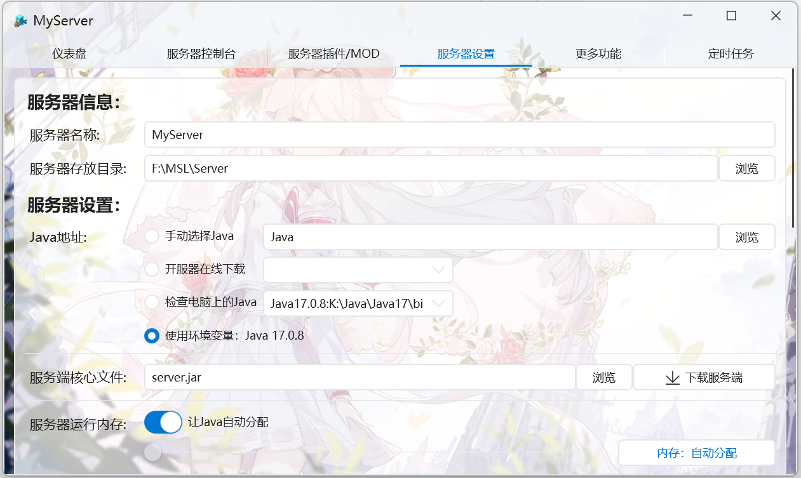
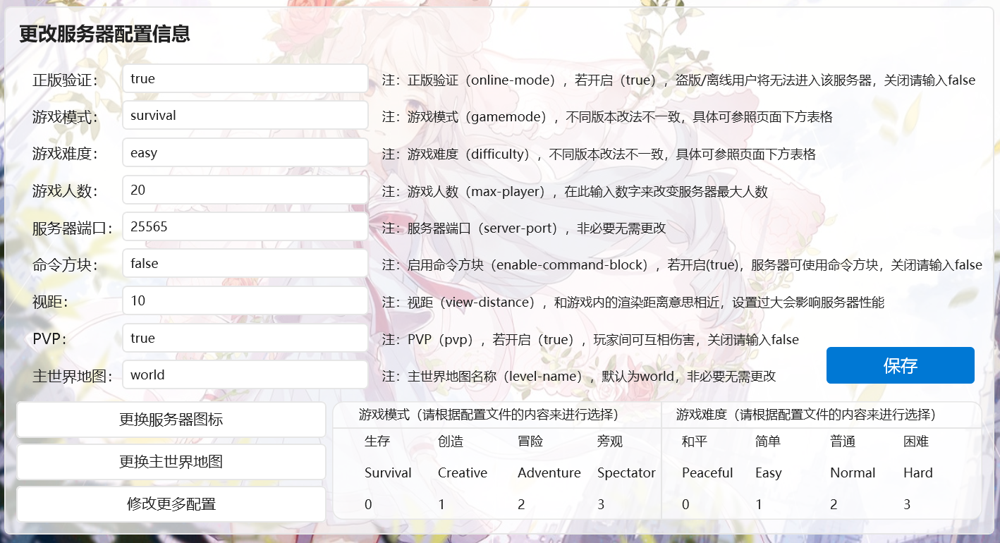
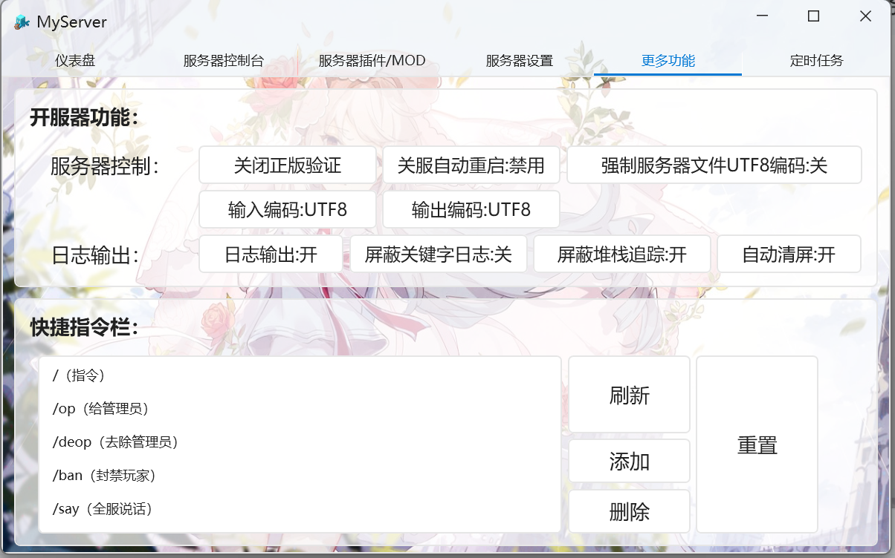

# 服务器相关配置&QA



服务器名称是显示的名称,实际上与开服无关,建议选择一个自己能区分的即可

服务器存放目录和服务端核心文件建议一旦配置完成就不要随意改动,否则很容易导致服务器无法开启

如果服务器开启失败且能确定和所安装的服务端/Mods/插件无关,则可以尝试调整java相关选项

如果提示分页文件过小则可以手动调整服务器运行内存~~但是我们还是建议你加钱上更多内存条~~

服务器JVM参数一般不需要改动,~~除非JVM是你亲生的你对怎么改很有自信~~



此处为服务器本体相关设置,修改客户端服务器选择界面上显示的服务器介绍可以点击```修改更多配置```,然后在右侧把```motd```一项改为想要的值即可

改完记得点保存!

---



如果出现乱码可以尝试调整输入输出编码

下方的快捷指令栏依照自己的需求调整即可