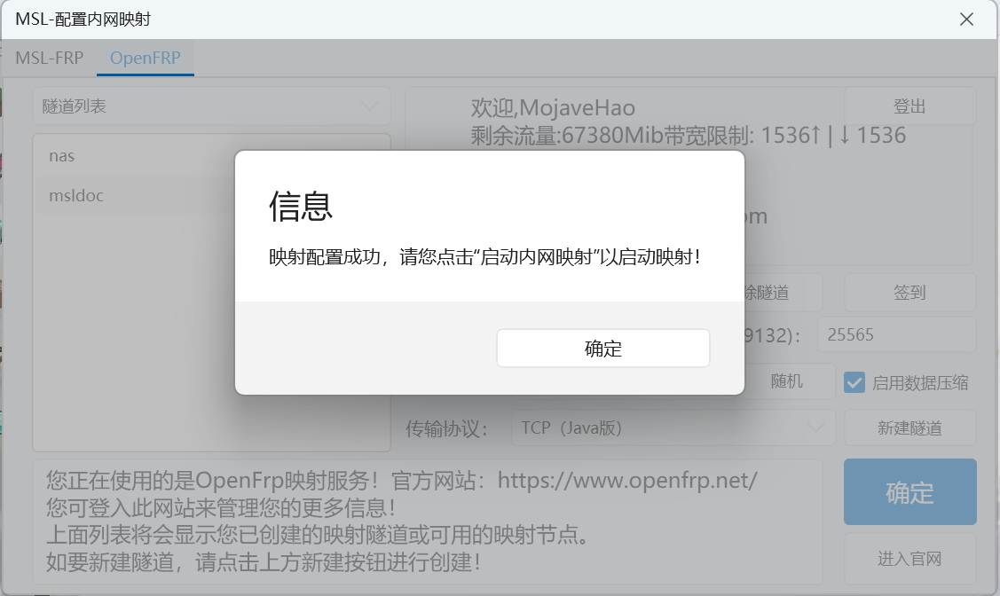

# 内网穿透配置

## MSL自带

点击图中的配置摁钮:


打开新窗口,在上方选择```MSL-FRP```:


在左侧选择节点,在右侧填写好信息即可,点击确定会保存配置并返回主窗口.

回到主窗口,点击```启动内网映射```摁钮即可启动:


## 使用OpenFrp
点击图中的配置摁钮:


打开新窗口,在上方选择```OpenFrp```,并根据提示注册/登录:


登陆完成后的效果如图:


如需创建新隧道,点击下方的```新建隧道(点击展开)```摁钮:


在左方选择欲使用的节点,一般来说越靠近玩家的节点延迟会越低;
同时在右侧配置相应的信息:


选择完配置后,点击```新建隧道```摁钮,输入隧道名:


提示创建成功后,在左边选择刚创建的隧道:




回到主窗口,点击```启动内网映射```摁钮即可启动:


输出的最后一条即为可供链接的地址和端口.